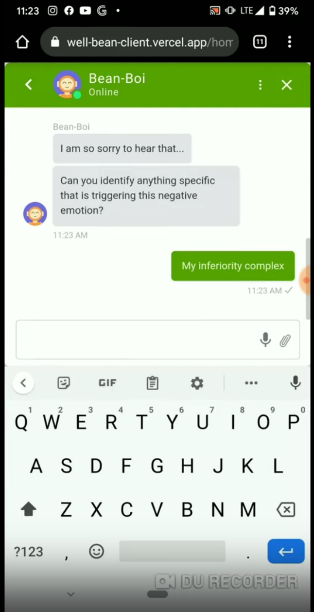
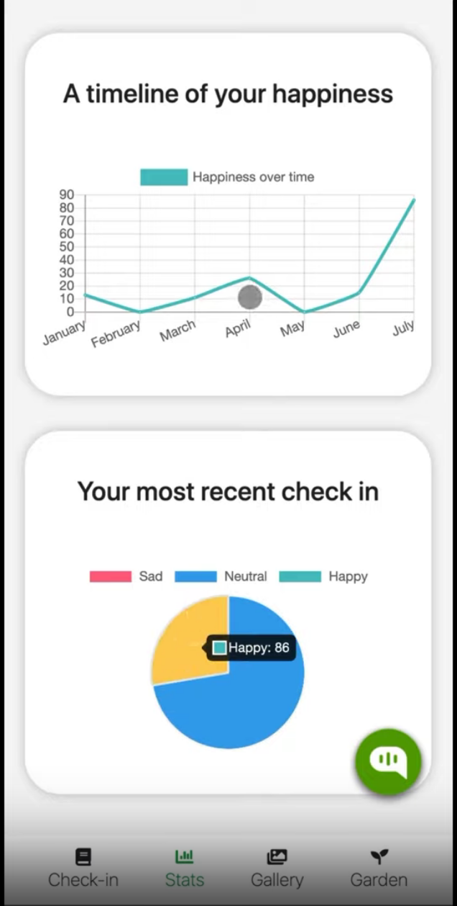
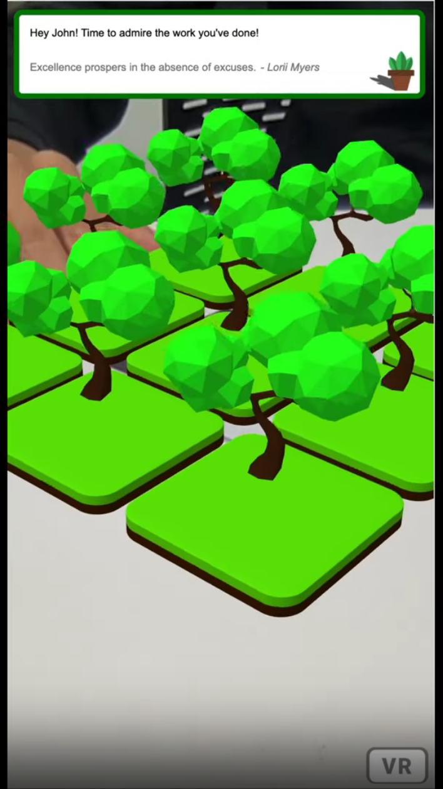

# Well bean

We care about everyone's well-bean. Check out our [Devpost!](https://devpost.com/software/well-bean)

## Inspiration

Mental health has always been a cause of great concern ever since the advent of the digital age but it is even more prevalent now due to the “new normal” as determined by COVID. Research has shown that feelings of anxiety and depressive tendencies have gone up by 400% in the last year. This can cause unhealthy side effects like substance abuse, loneliness, and sleep deprivation which could all be detrimental to one’s mental wellbeing. Our platform is designed to fight against these harmful emotions and instill an optimistic mindset so that you keep coming back for more growth.

## What it does

Our platform includes an AI-based video journaling check-in system which tracks your emotions over time and motivates you to keep coming back everyday by letting the user nurture for an Augmented Reality (AR) garden. Keeping your emotions hidden from others is a dominant cause for depression and research has found out that keeping a diary of major events of the day and how you reacted to them helps in building personal confidence and morale. Therefore, we incentivize the user to check-in to our platform once every 12 hours to record a video journaling their life. We also have a dashboard which tracks their happiness over time as well as the most dominant emotions in the most recent check-in by performing emotion detection on the video and tone detection on their voice.

Points called “BEANS!” are awarded to you every time a check-in is performed successfully and they are used to grow an AR garden where the height and number of the trees directly correlate to your total points. Watching the fruits of your labor pay off in front of your eyes is truly a magical moment. We also have a chatbot that connects you to a trained therapist if it detects any signs of depression after it performs a clinical assessment. Talking to our friendly chatbot, Beanboi, can never substitute quality time spent with a loved one but during such difficult times, even this could be seen as a blessing.

## Screenshots

<table>
  <tr>
    <td> </td>
    <td></td>
   </tr> 
   <tr>
    <td> </td>
    <td></td>
  </tr>
</table>

## How we built it

### AI-enhanced Video Journaling

We used a pre-trained ResNet-50 model trained to detect 7 types of emotions (happy, sad, disgust, anger, fear, surprise, and neutral) from a video stream. The audio from the video is used for tone analysis which detects the dominant emotion in the user’s voice. Computer Vision techniques were used to extract the faces from each frame and draw bounding boxes around them and show the percentage (out of 100) of their dominant emotion live in each frame.

### Emotion Analysis Dashboard

We used ReactJS for the client-side UI of our platform. The dashboard contains statistics graphed using ChartJS such as a line chart of happiness over time and a pie chart containing the proportions of emotions from the last check-in. All the data is retrieved from the user’s personal database on MongoDB. A list of the user’s past check-ins can be viewed from the Gallery tab so that they can see how they have changed over time.

### AR Garden

The user can hover their phone’s camera over an AR marker to display their garden. As soon as they do that, they should see the different varieties of trees growing in their 9x9 matrix garden. The simulations and animations are done using AR.js and the tree models as well as the grass tiles are modelled using Blender.

### Chatbot

Training of the chatbot is done on Google’s DialogFlow dashboard. It uses NLP and NLU methodologies to understand the context and intents of the text responses and act accordingly based on certain event triggers. The Kommunicate API was used to integrate the DialogFlow logic with our frontend application.

## Challenges we ran into

- Dlib
- Managing file storage and parsing of past check-in videos
- Deploying machine learning models locally as well as interaction between python modules from NodeJS server
- Creating an appropriate UI which is approachable yet encouraging
- Connecting a JS-based AR engine to the back-end and mapping information from the database

## Accomplishments that we're proud of

- Created a simplistic and welcoming UI which encourages users to visit more often and keep track of their mental health
- Combined data-manipulation, computer vision, and data visualization to paint a complete picture of the user’s current state
- Developed a dynamic AR garden which helps users visualize the true effects of their efforts
- The chatbot supports multiple lines of conversation depending on the user’s current mood

## What we learned

- How to use NodeJS’s exec function to run python/shell commands on the environment
- How to perform emotion recognition on faces live using video stream
- How important the psychology of our end-user is when designing the platform

## What's next for Well-Bean

- Finding more ways to measure user happiness such as social media interactions, etc.
- Adding friendly virtual pets which can act as cute friends for the user to play with
- Analyzing more emotions such as anger, surprise, etc.

## Our pitch video

[](https://www.youtube.com/watch?v=Pvnv2umzIcg)

## Web

Running the client:

```
cd server
npm run client
```

Running the server:

```
cd server
npm run server
```

Running both:

```
cd server
npm run dev
```

### Server

1. Create a database using [MongoDB Atlas](https://www.mongodb.com/cloud/atlas)
2. Obtain your Mongo URI using the **Connect** > **Connect your application** option
3. Create a `server/keys.js` file with the following code:

```
module.exports = {
    mongoURI: '<INSERT MONGO URI>'
}
```

4. Download necessary libraries using:

```
cd server
npm install
```

### Client

1. Download necessary libraries using:

```
cd client
npm install
```

2. Make a `/client/env` file of the format:

```
REACT_APP_GARDEN_URL=<INSERT AR URL>
```

## Credits

1. [Emotion recognition model](https://github.com/vjgpt/Face-and-Emotion-Recognition)
